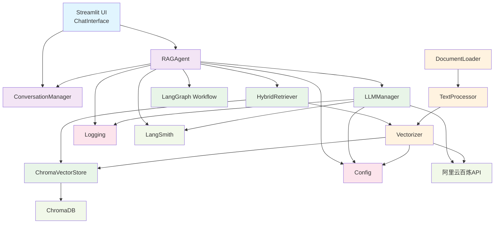
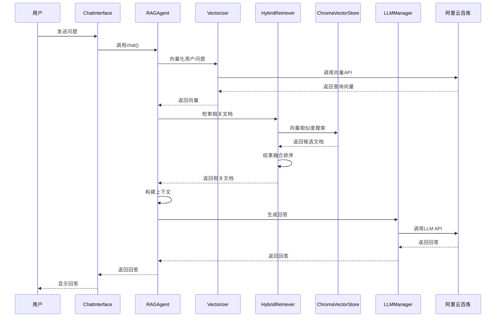
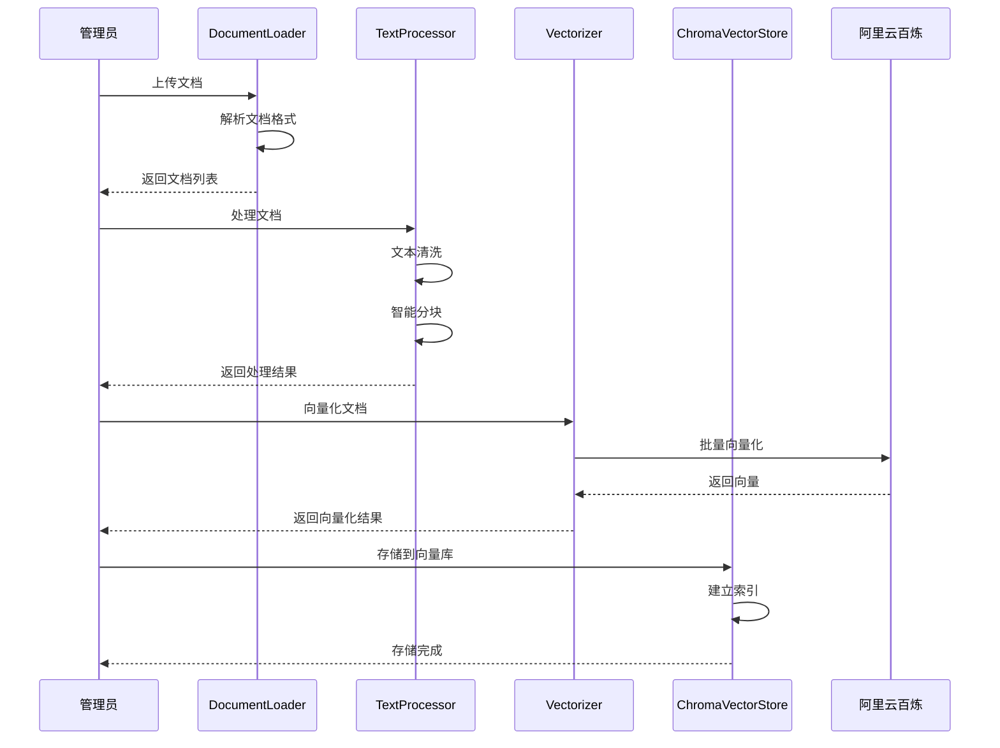
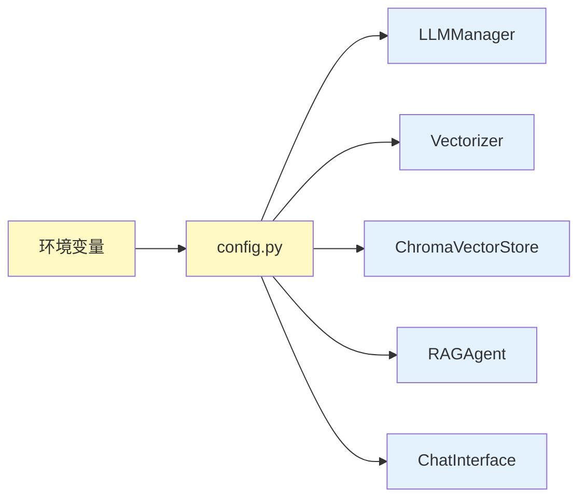
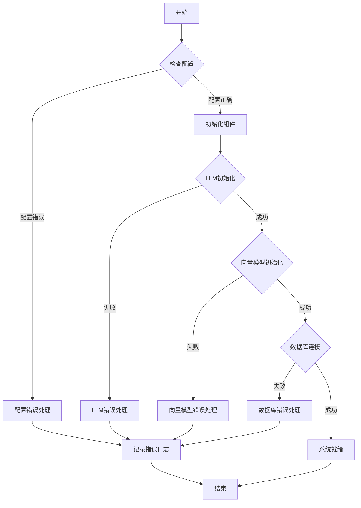

# 🔄 BarbellGPT 组件关系图

## 一、组件交互关系

## 二、数据流向图

### 2.1 问答流程数据流

### 2.2 知识库构建流程

## 三、组件职责矩阵

| 组件 | 主要职责 | 依赖组件 | 被依赖组件 |
|------|----------|----------|------------|
| **RAGAgent** | RAG核心逻辑、工作流协调 | LLMManager, HybridRetriever, ConversationManager | ChatInterface |
| **ConversationManager** | 对话历史管理 | 无 | RAGAgent |
| **LLMManager** | LLM调用和响应处理 | 阿里云百炼API | RAGAgent |
| **HybridRetriever** | 混合检索策略 | ChromaVectorStore, Vectorizer | RAGAgent |
| **ChromaVectorStore** | 向量存储管理 | ChromaDB | HybridRetriever |
| **Vectorizer** | 文本向量化 | 阿里云百炼API | HybridRetriever, DocumentLoader |
| **DocumentLoader** | 文档加载解析 | 无 | 管理员 |
| **TextProcessor** | 文本处理和分块 | 无 | DocumentLoader |
| **ChatInterface** | 用户界面 | RAGAgent | 用户 |

## 四、配置依赖关系

## 五、错误处理流程

## 六、性能优化策略

### 6.1 缓存策略
- **向量缓存**：查询向量缓存，避免重复计算
- **检索结果缓存**：相似查询结果缓存
- **LLM响应缓存**：相同问题回答缓存

### 6.2 批量处理
- **文档批量处理**：多文档同时处理
- **向量批量编码**：批量向量化提高效率
- **检索结果批量返回**：减少网络请求

### 6.3 异步处理
- **非阻塞UI**：用户界面响应式设计
- **后台处理**：文档处理在后台进行
- **并发检索**：多个检索器并发执行

## 七、监控指标

### 7.1 性能指标
- **响应时间**：问答响应延迟
- **吞吐量**：并发处理能力
- **准确率**：检索和生成准确性

### 7.2 系统指标
- **资源使用**：CPU、内存、存储
- **错误率**：各组件错误统计
- **可用性**：系统运行时间

### 7.3 业务指标
- **用户活跃度**：日活用户数
- **问答质量**：用户满意度
- **知识库覆盖**：文档数量和类型

---

*组件关系图展示了BarbellGPT各模块间的依赖关系和交互流程，为系统维护和扩展提供清晰指导。* 